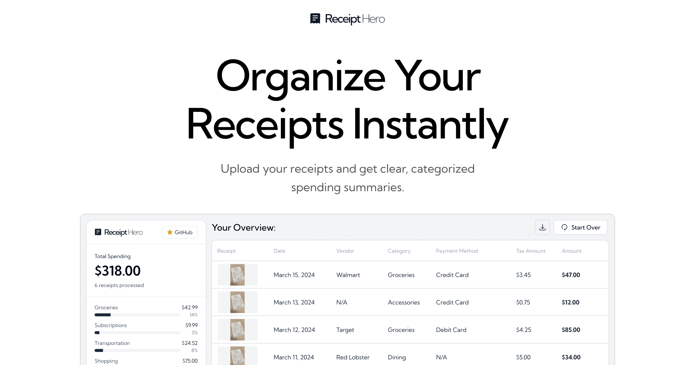

<a href="https://www.receipthero.app">
  
  <h1 align="center">ReceiptHero</h1>
</a>

  An open source receipt management app with AI-powered OCR. Powered by Together.ai.

## Tech stack

- Next.js app router with Tailwind CSS
- Together AI for LLM-powered OCR
- Llama 4 Scout 17B for receipt data extraction
- shadcn/ui components with Radix UI
- Zod for data validation

## How it works

1. Upload receipt images via drag & drop or file selection
2. Send images to Together AI's Llama model for OCR processing
3. Extract structured data: vendor, date, amount, items, currency, payment method
4. Automatically categorize expenses (groceries, dining, gas, etc.)
5. Display spending breakdown and receipt management interface
6. Store data locally in browser for privacy

## Cloning & running

1. Fork or clone the repo
2. Create an account at [Together AI](https://togetherai.link) for the OCR API
3. Create a `.env` file (use `.example.env` for reference) and add your API key
4. Run `npm install` and `npm run dev` to install dependencies and run locally
